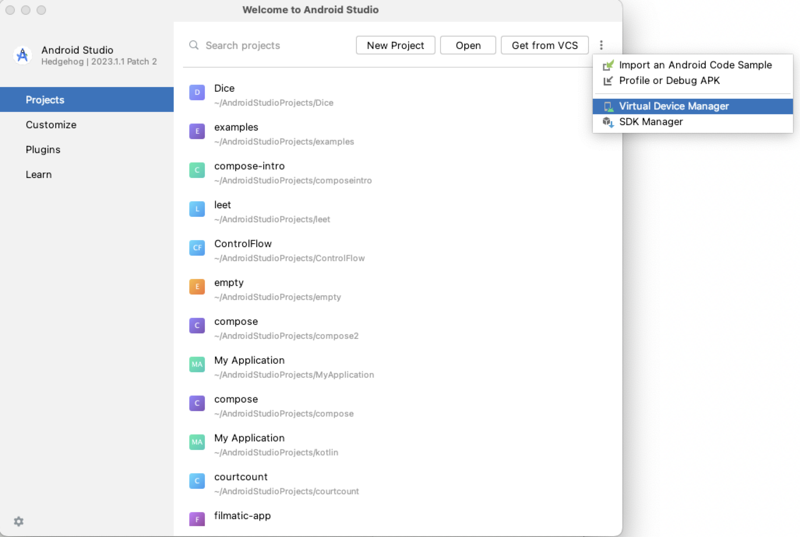
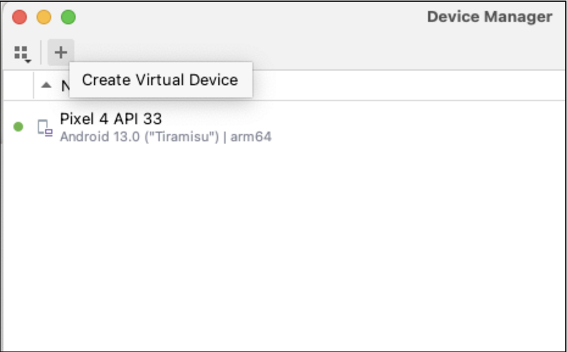
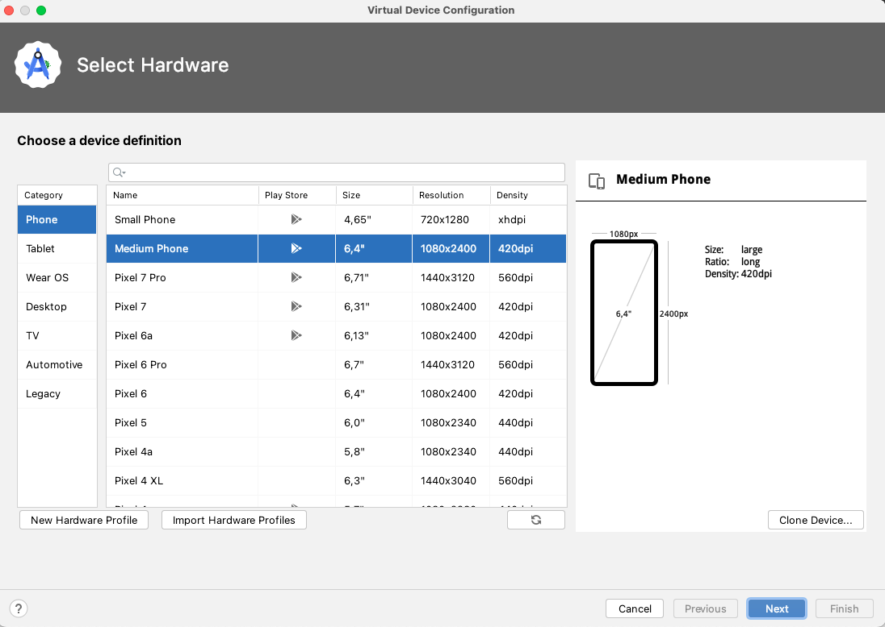
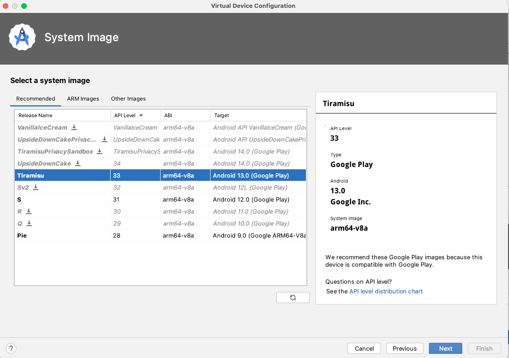
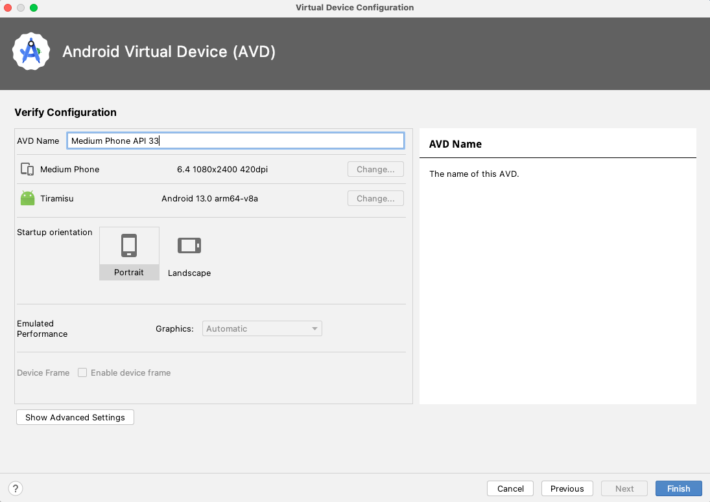
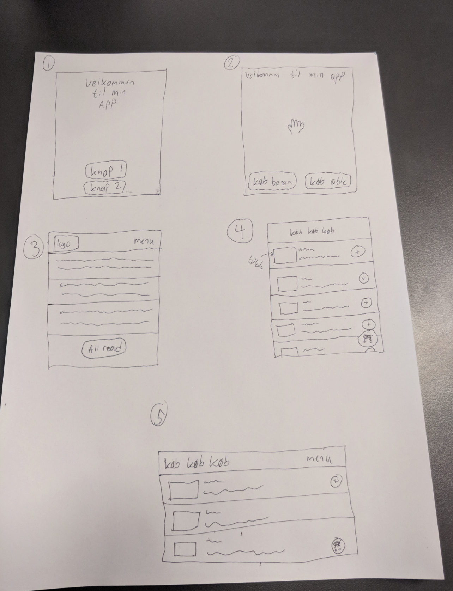
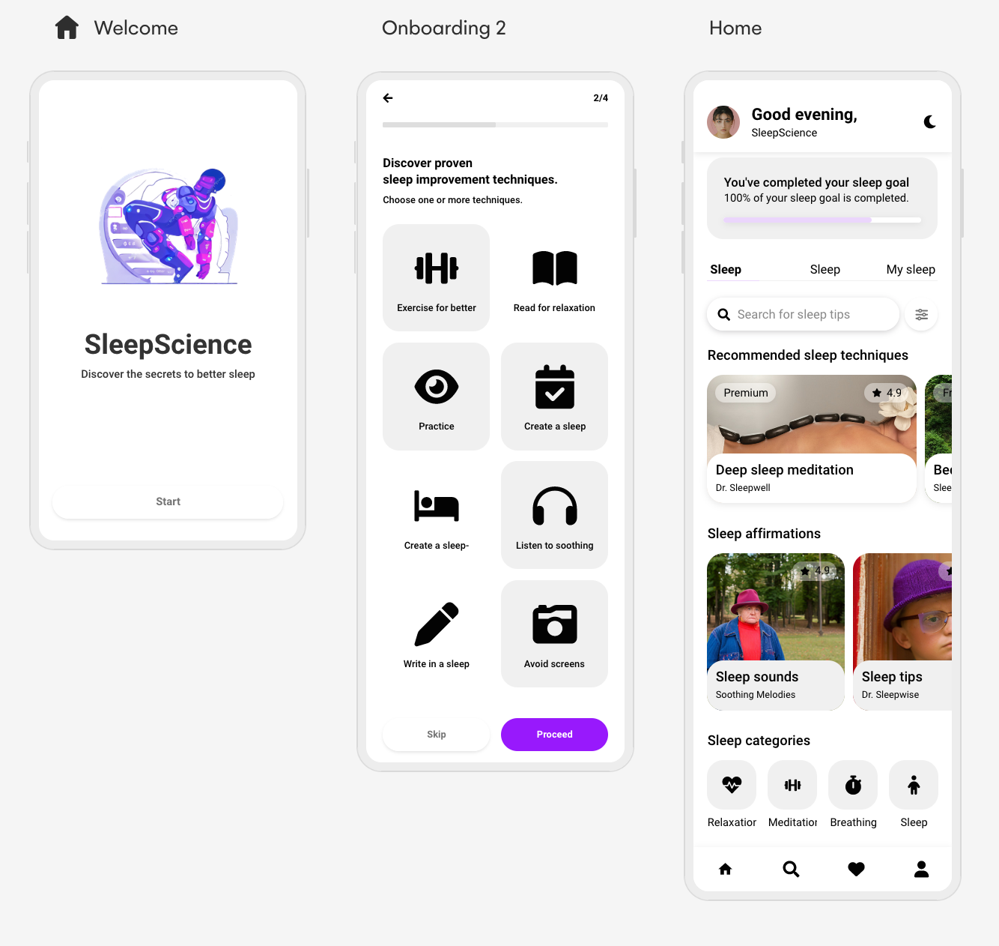

# Basic layout


## Overview

- Peer instruction
- Android Studio
- Native App vs web site vs Webapp
- Component based UI
- Benjamin recreates a layout from a Shape application
  - Component based thinking


## Learning goals

- Working in Android Studio
- `@Composable`
  - `@Preview`
- `Modifier`
- Layout
  - `Column` & `Row`
  - `Button`
  - `Text`


## Preparation

- Go through [this guide](https://developer.android.com/courses/pathways/android-basics-compose-unit-1-pathway-3). The two following elements are important, the rest is optional
  - Intro to Jetpack Compose (video)
  - Build a simple app with text composables (Codelab)


### Installing a virtual device








**Tiramisu > Next** 



**Default configuration > Finish**




## `@Composable`

`@composable` annotation informs the Compose compiler that this function is intended to convert data into UI


Here is fx a Composable that shows a Textfield

```kotlin
@Composable
fun SimpleComposable() {
    Text(text = "Simple Composable")
}
```


### `@Preview`

Here we can preview the app before launching it in the simulator


## `modifier`

Modify and change appearance of the composable


```kotlin
Text(
    text = "Hello $name!",
    color = Color.Blue,
    fontSize = 30.sp,
    modifier = Modifier
        .background(
            color = Color.Red,
        )
        .padding(16.dp)
        .border(
            width = 2.dp,
            color = Color.Red,
            shape = RoundedCornerShape(30.dp)
        ),

)
```


### `dp` vs `sp`

**DP (Density-Independent Pixels)**: Is a virtual pixel based on the pixel density of the screen. 

**SP (Scale-Independent Pixels)**: The same as above but takes the users chosen text size into account

In summary, use DP for all layout sizing, and use SP for text sizes. 


## `Column` & `Row`


`Column` er et layout hvor elementer bliver vist under hinanden. Ligesom Flexbox

```kotlin
Column {
    Text(
        text = "Hello $name!",
    )
    Text(
        text = "Benjamin",
    )
}
```


`Row` bliver elementerne vist ved siden af hinanden

```kotlin
Row {
    Text(
        text = "Hello $name!",
    )
    Text(
        text = "Benjamin",
    )
}
```


## `Button`

En komponent der laver en knap. En `Button` Composable skal kaldes med et `onClick` argument som tager en lambda funktion der bliver kaldt når knappen bliver klikket på. Fuldstændig ligesom Javascript faktisk!

Læg mærke til hvordan trailing lambdas bliver brugt her!

```kotlin
Button(onClick = {
		println("Button clicked!")
}) {
    Text(text = "Click this button")
}
```


## Exercises

Idag får i tid til at arbejde på jeres tøjbytte projekt. Det er vigtigt at i arbejder med at implementere UI i Compose UI! Fra firma/sketch til Compose UI komponenter. 

Hvis i ikke har et design at arbejde på, kan i arbejde på opgaverne herunder


### Layout

Recreate the following layouts



For this exercise you will need to do some research. Fx how to add an image, how column and rows work, etc. 


### Polished webapp

Try and recreate the following app interface as closely as you can




<!--

### Confetti app 🎉

Let's create an app that shows confetti when clicking on a button


#### Install the confetti module

Read about the Konfetti library [here](https://github.com/DanielMartinus/Konfetti)

In the `build.gradle.kts` file, add `implementation("nl.dionsegijn:konfetti-compose:2.0.4")` to the `dependencies {}` part

Now press `Sync Now` in the top to download and install the library

> This is like `npm install` for Java! The `build.gradle` is like the `package.json` file!


#### Add a confetti view to our your activity

```kotlin
class Konfetti : ComponentActivity() {
    override fun onCreate(savedInstanceState: Bundle?) {
        super.onCreate(savedInstanceState)
        setContent {
            val party = Party(
                speed = 0f,
                maxSpeed = 30f,
                damping = 0.9f,
                spread = 360,
                colors = listOf(0xfce18a, 0xff726d, 0xf4306d, 0xb48def),
                emitter = Emitter(duration = 100, TimeUnit.MILLISECONDS).max(100),
                position = Position.Relative(0.5, 0.3)
            )

            KonfettiView(
                modifier = Modifier.fillMaxSize(),
                parties = listOf(party)
            )
        }
    }
}
```


#### 🎉🎉🎉🎉🎉🎉

To actually start the confetti use this code

```java
konfettiView.start(party);
```


#### 📝 One button

Create a button that when clicked will start showing confetti


#### 📝 Two buttons

Create two buttons. When one button is clicked is should show short burts of confetti. For the other button is should show a long burst of confetti


#### 📝 Confetti where clicked

Make is possible so that where the user clicks there will be confetti. Maybe this mode could be activated with a slider.


#### 📝 Keep holding the button

Create a button that will spew confettit as long as the button is pressed!


#### Create a fart button 💨

When clicking a button a fart sound should be played

-->
