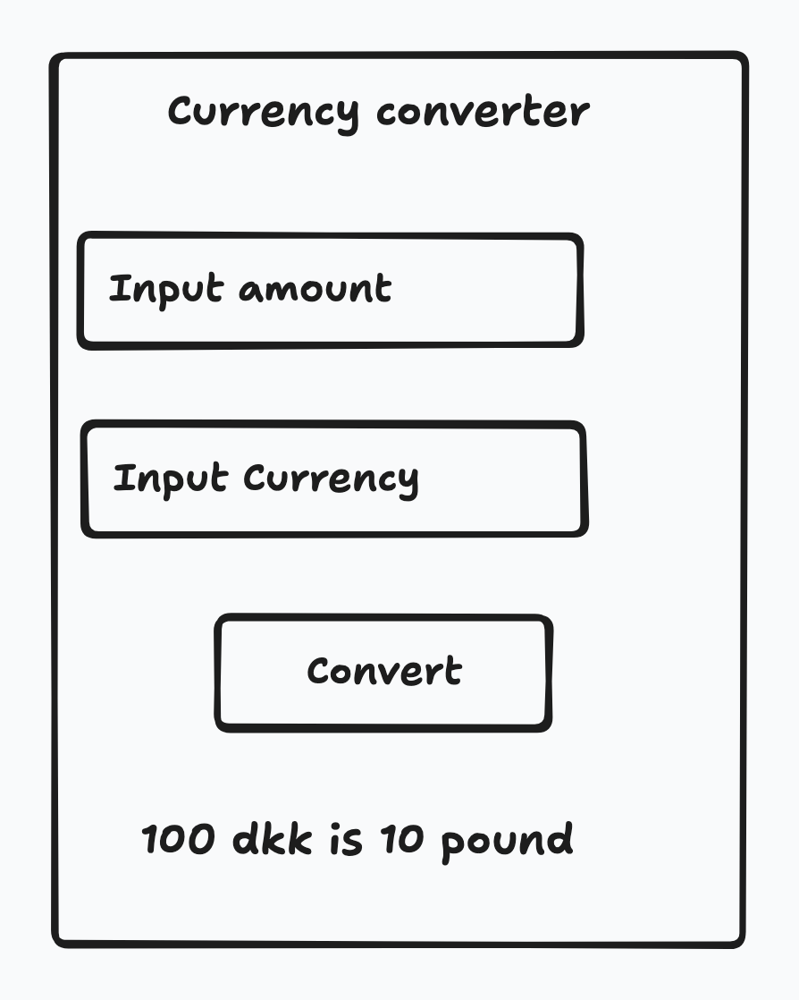
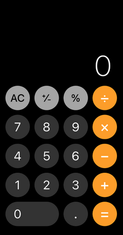

# UI & State

Compose is a declarative UI framework, meaning that you *declare* how the UI should look in your code.


## Læringsmål

- State
- Handle input in textField
- Trailing lambda


## Overview

- Konteksten semestret
- Vis constructor med Student hvor grades er i constructor. Ift hvad man bruger constructor til
- Me coding a Currency converter
- Præsenation af case for idag
- By keyword: [https://chat.openai.com/share/f89b4c49-03ba-4091-b503-11ce13a91207](https://chat.openai.com/share/f89b4c49-03ba-4091-b503-11ce13a91207)


<!--

- Hvor langt har du til arbejde?
- Hvor mange linjer kode har du skrevet i dit seneste projekt?
- Hvor mange billeder har du taget med dit kamera eller smartphone det sidste år?
- Hvor mange kopper kaffe drikker du i gennemsnit om ugen?
- Hvor mange mennesker kender du ca?
- Vejnummer

-->




## Preparation

- Gå igennem de her punkter i [den her guide](https://developer.android.com/courses/pathways/android-basics-compose-unit-2-pathway-3)
  - Understanding state in Compose - Video
  - Intro to state in Compose - Codelab


## Composition

The *Composition* is a description of the UI built by Compose when it executes composables. Compose apps call composable functions to transform data into UI.


### Initial composition

Initial composition is a creation of the UI by Compose when it executes composable functions the first time.


### Recomposition

Recomposition is the process of running the same composables again to update the tree when their data changes.


Recomposition to update the Composition of the app. When fx some ui needs to be updated when some input is changed


The *Composition* is a description of the UI built by Compose  when it executes composables. Compose apps call composable functions to transform data into UI. If a state change happens, Compose re-executes  the affected composable functions with the new state, which creates an  updated UI—this is called *recomposition*. Compose schedules a *recomposition* for you.

When Compose runs your composables for the first time during *initial composition*

*Recomposition* is when Compose re-executes the composables that  may have changed in response to data changes and then updates the  Composition to reflect any changes.

The Composition can only be produced by an *initial composition* and updated by *recomposition*. The only way to modify the Composition is through *recomposition*. To do this, *Compose needs to know what state to track* so that it can schedule the recomposition when it receives an update.

The value returned by the `mutableStateOf()` function:

- Holds state, which is the bill amount.
- Is mutable, so the value can be changed.
- Is observable, so Compose observes any changes to the value and triggers a recomposition to update the UI.


## State

State in an app is any value that can change over time.


### `remember`

`remember` keeps a value (any value) consistent across recompositions.


If the data is primitive (`Int`, `Double`, `Boolean`) then use `mutableStateOf` like this:

```kotlin
var price by remember {
   mutableStateOf(2)
}
```


If the data type is complex (`List`, `Map`, `String`) then use the relevant `mutableState` function. Fx if a `Map` use `mutableStateMapOf`. When the function is called it returns an instance of that type

```kotlin
var information by remember {
    mutableStateOf( mutableStateMapOf<String, Int>("price1" to 6));
}
```


### `mutableStateOf`

Calling `mutableStateOf` returns an observable that the Compose UI framework can keep track of. 

An observable is a pattern where changes to an object's property are observed and can trigger certain actions. In the case of Compose UI, it observes some change and then recomposes those relevant composable functions (thereby rendering the change)

That means that without the `mutableStateOf` when the `price` would be updated, nothing in the UI would happen because Compose can not track the changes

```kotlin
var price by remember {
   mutableStateOf(2)
}
```

In Jetpack Compose, `mutableStateOf` is designed to trigger recompositions when the state object itself changes (i.e., when a new  object is assigned to it). However, mutating the contents of an object  (like adding an item to a `MutableList`) does not count as a state change in this context.

When we change a list, fx by adding an element to it, the object is not reassigned, which means that no action will be triggered. Therefore we use the `mutableStateListOf`

So this would not trigger recomposition on `todoList`

```kotlin
var todoList: MutableList<Item> by remember {
    mutableStateOf(mutableListOf())
}
```

But this would

```kotlin
var todoList: MutableList<Item> by remember {
    mutableStateOf(mutableStateListOf())
}
```


### `Textfield` update value

When we have a `Textfield` we need to keep track of the text ourselves:

```kotlin
var textFieldText by remember {
    mutableStateOf("")
}

TextField(value = textFieldText, onValueChange = { textValue ->
    textFieldText = textValue;
})
```


## State hoisting

A *stateless* composable is a composable that doesn't have a state, meaning it doesn't hold, define, or modify a new state. On the other hand, a *stateful* composable is a composable that owns a piece of state that can change over time.

State hoisting is a pattern of moving state to its caller to make a component stateless.

how to write a type for a lambda function

```
onItemChecked:(Boolean) -> Unit
```


### Stateful versus stateless

A composable that uses `remember` to store an object creates internal state, making the composable *stateful*. 


## Magisk lommeregner

Vi skal lave en magisk lommeregner der kan hjælpe med et trylle trick der virkelig kan imponere




Lommeregneren skal virke som en normal lommeregner, MEN hvis den er i secret mode skal den give et resultat i bestemmer når man trykker på `=`. Tænk over hvordan man kan aktivere secret mode i en lommeregner. Hvad skal brugeren gøre?

Tænk også over hvordan brugeren får indtastet telefonnummer der skal stå i secret mode. Måske på opstart, måske en hemmelig menu der bliver aktiveret. Det er op til jer

I må meget gerne selv hoppe ud i at løse opgaven. 

For dem af jer der er lidt i tvivl om hvor i skal starte har jeg stilladseret opgaven lidt


### 1 - UI

Først få lavet UI'en til din app. Ikke tænk i funktionalitet endnu!

Brug et `Textfield` i toppen til at vise det man taster

Brug `Button` til alle de andre knapper


### 2 - Oprettelse af state variabler

Vi skal til at tænke over hvilken state vi har i appen. Som jeg ser det er der minimum to state variabler

- Teksten med det som skal vises i toppen af lommeregneren
- Om appen er i secret mode eller ikke. Sæt den til default at være `false`

Lav state variabler med de rigtige typer der kan tracke ændringer i state


### 3 - Ændring af state

Nu skal vi til at ændre state. Når man trykker på en af knapperne som tallene og plus, minus, gange og divider, skal teksten opdateres så den passer med de knapper brugeren har tastet.

Hvis fx brugeren trykker på `234`, `+` og `32`, skal der i textfeltet stå `234+32`

Lad os vente med `AC`, `+/-`, `%` og `.`


### 4 - Vis resultat

Når man klikker på `=` skal enten resultatet vises (hvis secret mode er `false`) ellers skal det tal brugeren har tastet ind vises (hvis secret mode er `true`)

Jeg har fået ChatGPT til at at lave en funktion der tager en streng af operationer og udfører operationerne. Den hedder `getResult`

```kotlin
getResult("2+34-10"); // 26
```


```kotlin

fun getResult(expression: String): Int {
    val tokens = tokenizeExpression(expression)
    return evaluateTokens(tokens)
}

fun tokenizeExpression(expression: String): List<String> {
    val regex = Regex("([*+/-])|([0-9]+)")
    return regex.findAll(expression).map { it.value }.toList()
}

fun evaluateTokens(tokens: List<String>): Int {
    val numberStack = Stack<Int>()
    val operatorStack = Stack<Char>()

    for (token in tokens) {
        when {
            token.isNumber() -> numberStack.push(token.toInt())
            token.isOperator() -> {
                while (!operatorStack.isEmpty() && hasHigherPrecedence(operatorStack.peek(), token[0])) {
                    val result = applyOperation(numberStack.pop(), numberStack.pop(), operatorStack.pop())
                    numberStack.push(result)
                }
                operatorStack.push(token[0])
            }
        }
    }

    while (!operatorStack.isEmpty()) {
        val result = applyOperation(numberStack.pop(), numberStack.pop(), operatorStack.pop())
        numberStack.push(result)
    }

    return numberStack.pop()
}

fun String.isNumber() = this.matches(Regex("\\d+"))
fun String.isOperator() = this.matches(Regex("[*+/-]"))
fun hasHigherPrecedence(op1: Char, op2: Char): Boolean {
    if (op1 == '*' || op1 == '/') return true
    if (op2 == '+' || op2 == '-') return true
    return false
}

fun applyOperation(a: Int, b: Int, op: Char): Int {
    return when (op) {
        '+' -> a + b
        '-' -> b - a
        '*' -> a * b
        '/' -> b / a
        else -> throw IllegalArgumentException("Unknown operator: $op")
    }
}
```


### 5 - Secret mode

Tillykke du har nu lavet en kommeregner app 🎉

Tænk over hvordan en bruger skal kunne aktivere secret mode. Prøv at brainstorme et par ideer

Prøv at implementere den ide der virker nemmest. Tjek om secret mode kan aktiveres og deaktiveres og at det virker. Det telefonnummer der skal vises kan i bare hardcode på det her trin


### 5 - Resten af knapperne

Implementer `AC` først. De andre knapper må i gerne prøve, men det kan være de giver nogle flere udfordringer, det er op til jer


### 6 - Indtast af telefonnummer

Hvordan får brugeren indtastet telefonnummeret? Igen brainstorm og vælg den nemmeste ide. 


### 7 - Færdiggør app

Kan du få lommeregneren til at ligne en rigtig lommeregner?

-->

<!--

## Exercises - Indkøbsseddel

Måske overvej lidt mere stilladsering her


Den her er for svær umiddelbart


Den her opgave er en Rite-of-passage for udviklere. Lidt ligesom hello world. Alle skal have prøvet at lave deres egen indkøbsseddel eller todo app. Funktionaliteterne er de samme:

I skal lave en indkøbsseddel app med disse features:

- Man skal kunne oprette nye elementer til indkøbssedlen
- Hvis der ikke er nogle elementer skal der stå "No elements, please create a new element"
- Elementerne skal stå i en liste
- Når man er færdig med et element skal man kunne strege den ud


Nice to have

- Man skal kunne flytte rundt på elementerne, så fx et element der er i bunden kan skubbes op i toppen
- Man skal kunne søge i sine elementer
- Man skal kunne sortere sine elementer på en måde (måske alfabetisk eller oprettelses tidspunkt)


Prøv først at få jeres interface på plads. Sketch gerne først og så få det ned på papir. Processen er rigtig fint beskrevet [her](https://developer.android.com/codelabs/basic-android-kotlin-compose-art-space?continue=https%3A%2F%2Fdeveloper.android.com%2Fcourses%2Fpathways%2Fandroid-basics-compose-unit-2-pathway-3%23codelab-https%3A%2F%2Fdeveloper.android.com%2Fcodelabs%2Fbasic-android-kotlin-compose-art-space#1). Altså hvordan man kommer fra wireframe/prototype til compose elementer


