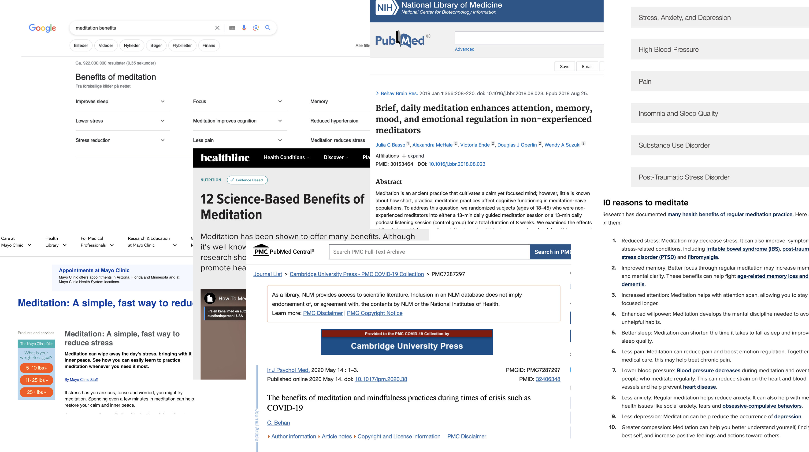
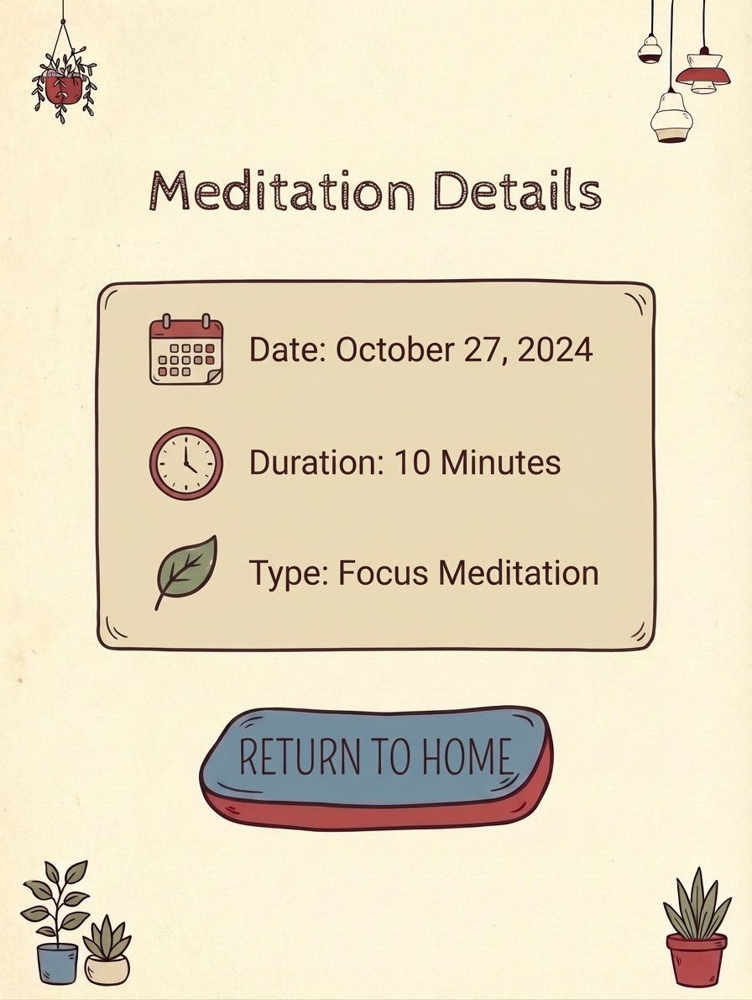
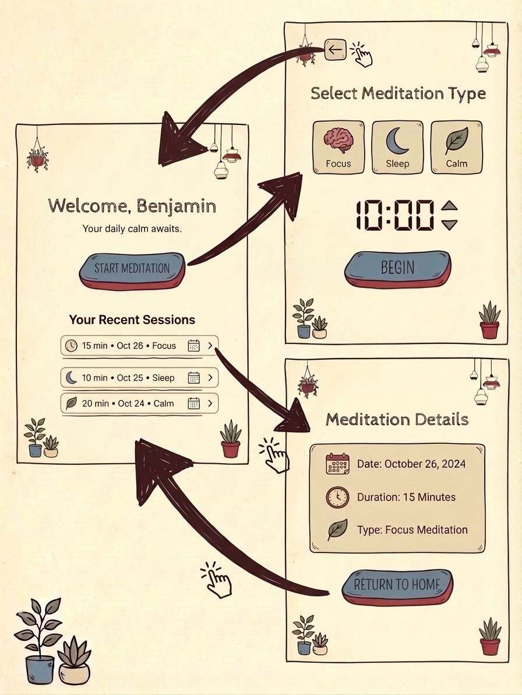

# Navigation


<!--

## After class considerations

- 

-->


## Learning goals

- Compose navigation
- `Navhost`
- `NavController`
- Backstack


## Overview

- Diskussion om forberedelse
- Small guided meditation through Medito
  - Quick intro to benefits from meditating
  - [https://meditofoundation.org/meditations/beginner-meditation-course](https://meditofoundation.org/meditations/beginner-meditation-course)
- Work on case. Recreate the navigation of the Medito App
- Tænk over hvilken GenAI app i vil lave til næste gang. Vi kommer til at have 2 gange til det





## Preparation

- Today you have prepare for yourself. How you do that is up to you. But you have to be able to go from one screen to another using Jetpack compose navigation
  - In the start of the class i would like to know how you prepared. Youtube? ChatGPT? Articles?


## Navigation

### Installation

Add this to your `build.gradle.kts` file under `dependencies`

```kotlin
val nav_version = "2.8.9"
implementation("androidx.navigation:navigation-compose:$nav_version")
```


### 3 parts

Navigation consists of 3 parts: 

1. `navhost` - Where the navigation will be displayed
2. `navController` - controls the navigation. Fx when goin from one page to another
3. `composable` - shows the different composable that can be navigated to


### `Navhost`

An empty container that displays the composables that are navigated to. Kind of like `index.html` shows different routes in react.

A NavHost is a Composable that displays other composable destinations, based on a given route. 

As you navigate between composables, the content of the `NavHost` is automatically [recomposed](https://developer.android.com/jetpack/compose/mental-model#recomposition).


### `NavController`

An object that manages app navigation within a `NavHost`. The `NavController` orchestrates the swapping of destination content in the `NavHost` as users move throughout your app.


### BackStack

[https://developer.android.com/guide/navigation/backstack](https://developer.android.com/guide/navigation/backstack)

The back stack consists of a stack of navigation screens. Every time you navigate to a new screen, the with fx `navController.navigate("screen1")` the stack new screen is added to the back stack. When the back button is pressed, the latest screen on the backstack is removed (or [poped](https://www.youtube.com/watch?v=o724TbnN4Mk) to be more precise)


### `popBackStack`

We can pop the back stack ourselves by calling `navController.popBackStack()`. This will be like pressing the back button

We can also pop back to a specific route `navController.popBackStack("screen1", false)`. Everything above that route will pop. The second argument specifies if the route itself should also be poped. 


### Sending data from on screen to another

Sending data (arguments) to another route is a bit tricky. Here is how it works:


### First setup the route

First we need to tell Compose that the route can take an argument, we do that in the route by adding the `sendArgumentsHere/{name}`. This is very much like in NodeJS/Express. We now need to tell Compose navigation that the route `sendArgumentsHere` can take some arguments. We do that with the `arguments = listOf(navArgument("name") { type = NavType.StringType })`. Here we tell Compose navigation that it can take one parameter that has a String as a type. 

Now to get the actual argument we write this:

```kotlin
val name = backStackEntry.arguments?.getString("name") ?: return@composable
SendArgumentsHere(name)
```

The first line gets the name argument from the backStack if the name argument is passed. Then we call the `SendArgumentsHere` Composable function with that argument


### Add the argument to the Composable

The Composable function need to take the name argument

```kotlin
@Composable
fun SendArgumentsHere(name: String) {
    Text(text = name)
}
```


### Navigate to the route with a specific name

This is the easy part:

```kotlin
navController.navigate("sendArgumentsHere/Benjamin");
```

Here we send the string `"Benjamin"` to the `SendArgumentsHere` composable function


## Code examples


### Simple navigation between two composables

```kotlin
package com.example.navigation

import android.os.Bundle
import androidx.activity.ComponentActivity
import androidx.activity.compose.setContent
import androidx.compose.foundation.layout.Column

import androidx.compose.material3.Button
import androidx.compose.material3.Text
import androidx.compose.runtime.Composable
import androidx.compose.ui.unit.sp
import androidx.navigation.compose.NavHost
import androidx.navigation.compose.composable
import androidx.navigation.compose.rememberNavController

class MainActivity : ComponentActivity() {
    override fun onCreate(savedInstanceState: Bundle?) {
        super.onCreate(savedInstanceState)

        setContent {
            val navController = rememberNavController()
            Column {
                Text(
                    text = "Navigation App Example",
                    fontSize = 45.sp
                )
                
                NavHost(navController = navController, startDestination = "home-screen") {
                    composable("home-screen") {
                        HomeScreen("benjamin",
                            onScreen2ButtonClick = {
                                navController.navigate("screen-2")
                            })
                    }
                    composable("screen-2") {
                        Screen2(onBackButtonClick = {
                          	// This will go back to the home-screen
                            navController.popBackStack()
                        })
                    }
                }
            }
        }
    }
}

@Composable
fun HomeScreen(name: String, onScreen2ButtonClick: () -> Unit) {
    Column {
        Text(
            text = "Screen 1",
            fontSize = 32.sp
        )
        Text(
            text = "Hello $name!"
        )
        Button(onClick = onScreen2ButtonClick) {
            Text("Go to Screen 2")
        }
    }
}

@Composable
fun Screen2(onBackButtonClick: () -> Unit) {
    Column {
        Text(
            text = "Screen 2!",
            fontSize = 32.sp
        )
        Button(onClick = onBackButtonClick) {
            Text("Back")
        }
    }
}
```


### Sending arguments from one screen to another

```kotlin
package com.example.navigation

import android.os.Bundle
import androidx.activity.ComponentActivity
import androidx.activity.compose.setContent
import androidx.compose.foundation.layout.Column
import androidx.compose.material3.Button
import androidx.compose.material3.Text
import androidx.compose.runtime.Composable
import androidx.compose.ui.unit.sp
import androidx.navigation.NavType
import androidx.navigation.compose.NavHost
import androidx.navigation.compose.composable
import androidx.navigation.compose.rememberNavController
import androidx.navigation.navArgument

class MainActivity : ComponentActivity() {
    override fun onCreate(savedInstanceState: Bundle?) {
        super.onCreate(savedInstanceState)

        setContent {
            val navController = rememberNavController()
            Column {
                Text(
                    text = "Navigation App Example",
                    fontSize = 45.sp
                )
                NavHost(navController = navController, startDestination = "home-screen") {
                    composable("home-screen") {
                        HomeScreen("benjamin",
                            onArgumentsButtonClick = {
                                val stringToSend = "Benjamin"
                                // this is how the "url" will look: sendArgumentsHere/Benjamin
                                navController.navigate("sendArgumentsHere/${stringToSend}")
                            })
                    }
                    composable("sendArgumentsHere/{name}", arguments = listOf(navArgument("name") { type = NavType.StringType })) { backStackEntry ->
                        val name = backStackEntry.arguments?.getString("name") ?: return@composable
                        SendArgumentsHere(name)
                    }
                }
            }
        }
    }
}

@Composable
fun HomeScreen(name: String, onArgumentsButtonClick: () -> Unit) {
    Column {
        Text(
            text = "Screen 1",
            fontSize = 32.sp
        )
        Text(
            text = "Hello $name!"
        )
        Button(onClick = onArgumentsButtonClick) {
            Text("To arguments screen")
        }
    }
}

@Composable
fun SendArgumentsHere(name: String) {
    Text(text = "This is from the arguments: $name")
}
```


## 📝 Discuss preparation in class - 10 min

How is navigation done in Compose UI?


## 📝 Case - Create the navigation for this meditation app

Vis hvordan jeg har lavet UI: [https://aistudio.google.com/prompts/1VSf5hD4kf1n8eq0ljRZkojQPZdhr_OIh](https://aistudio.google.com/prompts/1VSf5hD4kf1n8eq0ljRZkojQPZdhr_OIh)


### Welcome screen

### Step 1

Firstly create the welcome screen. Don't spend too much time on design. The focus here is navigation.


### Step 2

When clicking the `START MEDITATION` button the user should be navigated to the `start meditation` screen. 


### Step 3

When clicking one of the recent sessions the user should be taken to the meditation details screen that matches the meditation clicked on! This could be done in some different ways. The preferable is that the id of the clicked session is sent using the code above. 

There needs to be a list of `Meditation` objects in a `viewModel`. 

.jpg)


### Start meditation screen

Nothing here should be interactive except from the back button. This should take the user back to the welcome screen.

.jpg)


### Meditation details screen

Here the date, duration and type should come from the clicked meditation




### Flow between screens



