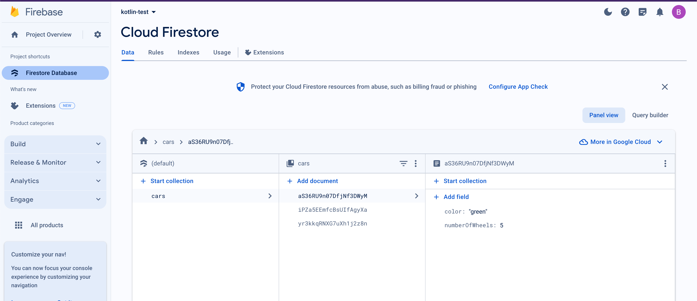
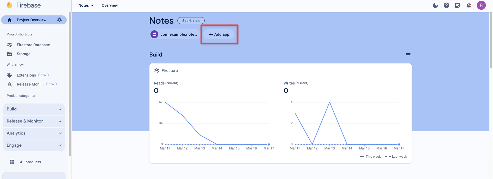

# Firebase Cloud Firestore


## Overview

- [https://www.youtube.com/ariathome](https://www.youtube.com/ariathome)
- Viewmodel statehoisting recap
  - Start med `forEach`
- Intro til Cloud Firestore
  - Create a new database with a collection and a document
- ORM
  - 

- Benjamin laver en app der kan gemme data
- Ane præsenterer hendes app struktur
- Arbejd med opgaver
- Pause kl 10
- Studenterpræsentation kl 11:30
- Create an app that uses firestore to save some entities (notes, videos, recipes, whatever)


<!--

## After class consideration

- Idag var alt for svær. Opgaven med konsulenten var for tricky.
- De skulle bare have fået success med firebase og firestore til at begynde med

-->


## Create your Firestore in Firebase

go to [https://console.firebase.google.com/?pli=1](https://console.firebase.google.com/?pli=1) -> add project, give it a name -> Add analytics if necessary -> click create


Go into your Firestore and under `Get started by adding Firebase to your app` click on Android. Follow the guide. 


Now create a Database in your Firestore. Go to your firebase project -> click Cloud Firestore -> click Create database. Select `Start in test mode`

**🚨OBS!!!!!🚨**: The default security rules for test mode allow anyone with your database reference to view, edit and delete all data in your database for the  next 30 days **🚨OBS!!!!!🚨**

Now in your `build.gradle.kts` (Module App) add the following line

```
implementation("com.google.firebase:firebase-firestore")
```


## Secure your data

```json
// Allow read/write access on all documents to any user signed in to the application
service cloud.firestore {
  match /databases/{database}/documents {
    match /{document=**} {
      allow read, write: if request.auth != null;
    }
  }
}
```


## Create a Collection in Cloud Firestore

Go to your Cloud Firestore database



Click `Start collection` -> Give it a name -> Now create a document:

Give it an Auto-id and create the relevant fields and values for your first document


## Setting up Firestore

First we need to import the right libraries in the file you will be using

```kotlin
import com.google.firebase.Firebase
import com.google.firebase.firestore.firestore
```


Then you need to create a new instance of a Firestore database

```kotlin
val db = Firebase.firestore
```


## Saving data

We are now ready to use kotlin to save data in our database


### Creating a data class

To hold data we will be using a specific kind of class called a data class. A `data class` is a special class type primarily intended to hold data. The most important feature for us is the serialisation method. Serialization refers to the process of converting an object into a  format that can be stored or transmitted (like JSON, binary, etc.)

Let's create a `Car` data class that matches the fields in the Firestore database:

```kotlin
import com.google.firebase.firestore.DocumentId

data class Car(
    val color: String = "", // Make properties public
    val numberOfWheels: Int = 0, // Provide default values
  	@DocumentId var documentId: String? = null
) 
```

The important is the `documentId` annotation! It ensures that the documentId from Firestore is put into the object when fetching and creating! That is because Firestore creates the id not us! At least by default


### Saving an object into Firestore

We now have all we need. Create a new object and add it to the database using the following code and the `.add` function

```kotlin
suspend fun save() {
  // Create a new user with a first and last name. Here Firestore will create a DocumentId but we dont need to add it when creating an object
  val greenCar = Car("green", 5);

  // Add a new document with a generated ID
  db.collection("cars")
      .add(greenCar)
      .await()
}

```


## Getting data from Firestore

To get data from Firestore we use the `.get` function

```kotlin
suspend fun getAll():List<Prompt> {
    // Add a new document with a generated ID
    return db.collection("prompts")
        .get()
        .await()
        .toObjects(Prompt::class.java)
}
```

Here we get the `result` from the database and then convert the result into an object we can work with in Kotlin using the `toObjects` method: 


It is also possible to delete and edit


## Exercise

Der er to slags opgaver idag. Den første er fokuseret på at i skal have forbindelse til Firestore og lave nogle simple ting med det. 

Den anden del fokuserer på hvordan man ville bruge Firestore i et mere "professionelt" setup


### Opgave 3 - Todoist's Nye Notes-App Eventyr!

**Arbejd i studiegrupper!**

Godt gået med Todo-listen! Michael var *så* begejstret for jeres arbejde med Clean Architecture, at han næsten  glemte alt om MV-et-eller-andet. Jeres indsats har virkelig hjulpet  Todoist!

Nu har Michael og Todoist fået blod på tanden og vil udvide deres produktportefølje. De vil bygge en **Notes-app**! De har fået fingrene i et eksisterende projekt fra en (nu opkøbt) konkurrent. Dette projekt *skulle* efter sigende være bygget med en mere "professionel" arkitektur fra  starten. Michael er dog lidt skeptisk efter sidste oplevelse og vil  gerne have *jer*, hans favorit-konsulenter, til at kigge på det.

"Det ser pænere ud ved første øjekast," siger Michael, "men jeg har på  fornemmelsen, at der lurer problemer under overfladen. Og vi mangler  altså nogle helt basale funktioner! Kan I hjælpe os med at få styr på  denne her Notes-app, så den lever op til Todoist-standarden?"

Prototypen til den nye Notes-app kan findes her: [https://github.com/behu-kea/note-app](https://www.google.com/url?sa=E&q=https%3A%2F%2Fgithub.com%2Fbehu-kea%2Fnote-app)

Michael nævner også, at denne app bruger noget fancy "Firestore" til at gemme data i skyen.

### Klargøring til Konsulentarbejdet

Før I for alvor kan gå i gang med at analysere og forbedre appen, skal I have den op at køre i jeres eget udviklingsmiljø. Det kræver et par trin for at forbinde til jeres *egen* Firestore-database (så I ikke roder i Todoist's produktionsdata!):

1. Tilføje en notes Collection i din Firestore database! 


2. Tilføje det nye projekt, så projektet kan tilgå jeres database. Her skal i skrive jeres package navn og så hente `google-services.json` filen ned og overskrive den der allerede ligger i projektet!




### Konsulentopgaverne

Nu hvor I har adgang og kan køre appen, er det tid til at smøge ærmerne op:

1. **Arkitektur-Analyse:** Start med at dykke ned i koden. Hvordan er projektet struktureret?  Hvilke arkitekturmønstre eller principper er brugt (måske er det her, Michael's MV-et-eller-andet kommer i spil?) Forstå flowet i appen –  hvordan data hentes, vises, og (potentielt) gemmes. **I skal kunne forklare appens virkemåde og arkitektur for Michael.**
2. **Bug Jagt – Michael's Hovedpine:**
   - **Bug Fix 1:** "Der er et eller andet galt," mumler Michael. "Noget opfører sig  bare... mærkeligt. Jeg kan ikke helt sætte fingeren på det, men det er *ikke* søgningen (den virker slet ikke endnu)." Jeres opgave: Find den skjulte bug i appens kernefunktionalitet og fiks den!
   - **Bug Fix 2:** Der er noget mærkelig med navigationen. Analyser hvordan man navigerer i appen. Er der noget, der kan optimeres? Implementer en forbedring af navigationsflowet.
3. **Feature Implementering – Michael's Ønskeliste:**
   - **Feature 1 - Søgning:** "Vores brugere *skal* kunne finde deres noter hurtigt!" Implementer søgefunktionaliteten. Når brugeren skriver i et søgefelt, skal listen af noter dynamisk  filtreres, så kun relevante noter vises.
   - **Feature 2 - Slet Note:** "Helt ærligt, en notes-app uden slette-funktion?!" Michael ryster på  hovedet. Tilføj en måde for brugeren at slette en note på. Hvordan I gør det (swipe, knap, langt tryk?), er op til jer som design-minded  konsulenter.
   - **Feature 3 - Direkte Note Opslag:** Michael har en specifik forespørgsel: "Kunne vi lave en funktion –  måske til internt brug eller support – hvor man kan indtaste ID'et på en note og se dens indhold direkte?" Lav en ny skærm eller et view, hvor  man kan indtaste et note-ID og få vist notens titel og tekst.

**Vigtig Note fra Michael:** "Jeg stoler på jer! Men husk nu, efter sidste omgang med den AI-genererede kode, vil bestyrelsen gerne se, at *I* tænker jer om og skriver den *nye* kode selv. Brug jeres viden om god arkitektur og kodningspraksis – det er *jer*, der er eksperterne her, ikke en eller anden chat-robot!"

Held og lykke, konsulenter! Todoist regner med jer!


### Firestor App

Create an app that can add, get, delete and update some entities that are saved in a Firestore database. The UI does not really matter, and try not to focus too much on architecture or hoisting state and all that. 


Focus on the syntax of getting Firestore to work!


