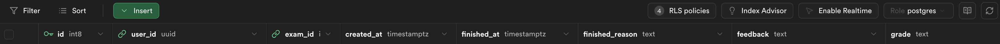
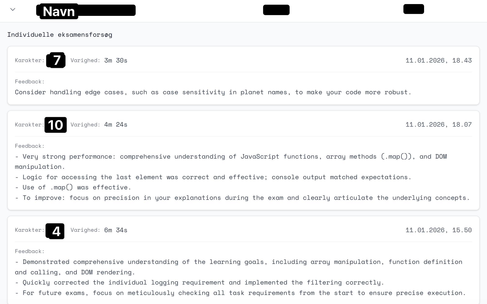

# Supabase


## AI bug

På [https://mineksamen.dk/](https://mineksamen.dk/) fandt jeg en bug da jeres klasse begyndt at bruge toolet 😱

<!--

Lad mig først forklare hvordan en eksamen forløber på mineksamen:

1. Når en bruger trykker på `Start eksamen` bliver der oprettet en række i `exam_logs`. Den bliver oprettet med et `created_at` tidspunkt
2. Når brugeren klikker på `Afslut eksamen` opdaterer jeg den række i `exam_logs` med `finished_at`, `finished_reason`, `feedback` og `grade`. Så med andre ord gemmer jeg karakteren, feedback, hvornår eksamen blev aflsluttet og hvorfor. I kan se `exam_logs nedenfor`





Nu kommer buggen så! Jeg kunne se at en studerende en dag havde fået et 7 tal, men dagen efter havde han taget en ny eksamen hvor han havde fået 10. Problemet var bare at han den eksamen hvor han havde fået 7 stod nu pludselig som 10. Når man har fået en karakter skal den aldrig kunne laves om. Der var altså en bug. 

**Hvad tror i buggen var? Hvordan ville i debugge det?**


Her er koden hvor fejlen var:

```typescript
await supabase
  .from("exam_logs")
  .update({
    finished_at: new Date().toISOString(),
    finished_reason: finishedReason,
    grade: grade,
    feedback: feedback,
  })
  .eq("user_id", userId)
  .eq("examID", examId);
```

**Hvad tror i nu fejlen er?**


UI der viser hvordan mineksamen ser ud fra en undervisers perspektiv




Okay. Så buggen var altså at den opdaterede alle eksamenerne for en studerende på en eksamen. Men man kan jo have taget mange eksamener.


Jeg spurgte om AI ikke ville komme med en løsning til problemet. Her er hvad den forslog (jeg har desværre ikke samtalen længere, ellers ville jeg have taget screenshots derfra). Kun opdater den seneste eksamen

```typescript
const { data: latestExam } = await supabase
  .from("exam_logs")
  .select("id")
  .eq("examID", examId)
  .order("created_at", { ascending: false })
  .limit(1)
  .single();

await supabase
  .from("exam_logs")
  .update({
    finished_at: new Date().toISOString(),
    finished_reason: finishedReason,
    grade: grade,
    feedback: feedback,
  })
  .eq("id", latestExam.id);
```

**Hvad synes i om den approach? Hvad er fordele ulemper?**


Her er hvad jeg gjorde:

```typescript
await supabase
  .from("exam_logs")
  .update(updates)
  .eq("id", examLogId);
```

-->


## Overview

- [https://www.youtube.com/watch?v=0Ssi-9wS1so&t=990s](https://www.youtube.com/watch?v=0Ssi-9wS1so&t=990s)
- Vibe kodning bug fix
  
- Vis slides
  - Intro til Supabase
  - Open source postgres database
  - RLS
  - Repositories pattern
  
- Supabase med Kotlin
  - [Getting started](https://supabase.com/docs/guides/getting-started/quickstarts/kotlin)
  - [https://supabase.com/docs/guides/getting-started/tutorials/with-kotlin](https://supabase.com/docs/guides/getting-started/tutorials/with-kotlin)
- Benjamin laver en app der kan gemme data
- Arbejd med opgaver
- Pause kl 10
- Studenterpræsentation kl 11:30


## Topics


## Creating the client to work with

```kotlin
val supabase = createSupabaseClient(
    supabaseUrl = "SUPABASEURL",
    supabaseKey = "SUPABASEKEY"
) {
    install(Postgrest)
}
```


### Creating the entity

Add the `@Serializable` annotation before the class

```kotlin
@Serializable
data class Instrument(
    val id: Int? = null,
    val name: String,
)
```


### Selecting entities

```kotlin
return supabase
  .from("instruments")
  .select()
```


### Creating entities

```kotlin
supabase
  .from("instruments")
  .insert(instrument)
```


### Deleting entities

```kotlin
supabase
  .from("instruments")
  .delete {
      filter {
          eq("id", id)
      }
  }
```


### Install Firebase

Følg de her guides:

- [Getting started](https://supabase.com/docs/guides/getting-started/quickstarts/kotlin)
- [https://supabase.com/docs/guides/getting-started/tutorials/with-kotlin](https://supabase.com/docs/guides/getting-started/tutorials/with-kotlin)


## Exercise

Der er to slags opgaver idag. Den første er fokuseret på at i skal have forbindelse til Supabase og lave nogle simple ting med det. 

Den anden del fokuserer på hvordan man ville bruge Supabase i et mere "professionelt" setup


### Opgave 1

Brug det her projekt som reference, men kun hvis det hjælper jer! [https://github.com/behu-kea/ita25-2sem-code/tree/main/supabaseexample](https://github.com/behu-kea/ita25-2sem-code/tree/main/supabaseexample)

Lav en app der kan hente, oprette, slette og opdatere en bestemt type entiteter: Eksamener, Fodboldhold, Patienter, Træningsprogram. Det er sådan set lige meget, bare noget i finder interessant. Hvordan i gør det er op til jer. 

Vær obs på jeres RLS!


### Opgave 2

I kan vælge at fortsætte jeres Generativ AI app eller arbejde på Todoist's casen


### Todoist's Nye Notes-App Eventyr!

**Arbejd i studiegrupper!**

Godt gået med Todo-listen! Michael var *så* begejstret for jeres arbejde med Clean Architecture, at han næsten glemte alt om MV-et-eller-andet. Jeres indsats har virkelig hjulpet  Todoist!

Nu har Michael og Todoist fået blod på tanden og vil udvide deres produktportefølje. De vil bygge en **Notes-app**! De har fået fingrene i et eksisterende projekt fra en (nu opkøbt) konkurrent. Dette projekt *skulle* efter sigende være bygget med en mere "professionel" arkitektur fra  starten. Michael er dog lidt skeptisk efter sidste oplevelse og vil gerne have *jer*, hans favorit-konsulenter, til at kigge på det.

"Det ser pænere ud ved første øjekast," siger Michael, "men jeg har på  fornemmelsen, at der lurer problemer under overfladen. Og vi mangler altså nogle helt basale funktioner! Kan I hjælpe os med at få styr på  denne her Notes-app, så den lever op til Todoist-standarden?"

Prototypen til den nye Notes-app kan findes her: [https://github.com/behu-kea/note-app](https://www.google.com/url?sa=E&q=https%3A%2F%2Fgithub.com%2Fbehu-kea%2Fnote-app)

Michael nævner også, at denne app bruger noget fancy "Supabase" til at gemme data i skyen.


### Klargøring til Konsulentarbejdet

Før I for alvor kan gå i gang med at analysere og forbedre appen, skal I have den op at køre i jeres eget udviklingsmiljø. Det kræver et par trin for at forbinde til jeres *egen* Supabase-database (så I ikke roder i Todoist's produktionsdata!):

1. Lav en ny tabel der hedder `notes` i Supabase. Den skal have følgende kolonner
   1. Id: Int
   2. Title: String
   3. Note_text: String
2. I `NotesRepository.kt` kopier jeres offentlige URL og KEY ind!
3. Prøve at lave en ny note i Supabase. Den skulle gerne dukke op på jeres app!


### Konsulentopgaverne

Nu hvor I har adgang og kan køre appen, er det tid til at smøge ærmerne op:

1. **Arkitektur-Analyse:** Start med at dykke ned i koden. Hvordan er projektet struktureret?  Hvilke arkitekturmønstre eller principper er brugt (måske er det her, Michael's MV-et-eller-andet kommer i spil?) Forstå flowet i appen –  hvordan data hentes, vises, og (potentielt) gemmes. **I skal kunne forklare appens virkemåde og arkitektur for Michael.**
2. **Bug Jagt – Michael's Hovedpine:**
   - **Bug Fix 1:** "Der er et eller andet galt," mumler Michael. "Noget opfører sig  bare... mærkeligt. Jeg kan ikke helt sætte fingeren på det, men det er *ikke* søgningen (den virker slet ikke endnu)." Jeres opgave: Find den skjulte bug i appens kernefunktionalitet og fiks den!
   - **Bug Fix 2:** Der er noget mærkelig med navigationen. Analyser hvordan man navigerer i appen. Er der noget, der kan optimeres? Implementer en forbedring af navigationsflowet.
3. **Feature Implementering – Michael's Ønskeliste:**
   - **Feature 1 - Søgning:** "Vores brugere *skal* kunne finde deres noter hurtigt!" Implementer søgefunktionaliteten. Når brugeren skriver i et søgefelt, skal listen af noter dynamisk  filtreres, så kun relevante noter vises.
   - **Feature 2 - Slet Note:** "Helt ærligt, en notes-app uden slette-funktion?!" Michael ryster på  hovedet. Tilføj en måde for brugeren at slette en note på. Hvordan I gør det (swipe, knap, langt tryk?), er op til jer som design-minded  konsulenter.
   - **Feature 3 - Direkte Note Opslag:** Michael har en specifik forespørgsel: "Kunne vi lave en funktion –  måske til internt brug eller support – hvor man kan indtaste ID'et på en note og se dens indhold direkte?" Lav en ny skærm eller et view, hvor  man kan indtaste et note-ID og få vist notens titel og tekst.

**Vigtig Note fra Michael:** "Jeg stoler på jer! Men husk nu, efter sidste omgang med den AI-genererede kode, vil bestyrelsen gerne se, at *I* tænker jer om og skriver den *nye* kode selv. Brug jeres viden om god arkitektur og kodningspraksis – det er *jer*, der er eksperterne her, ikke en eller anden chat-robot!"

Held og lykke, konsulenter! Todoist regner med jer!
