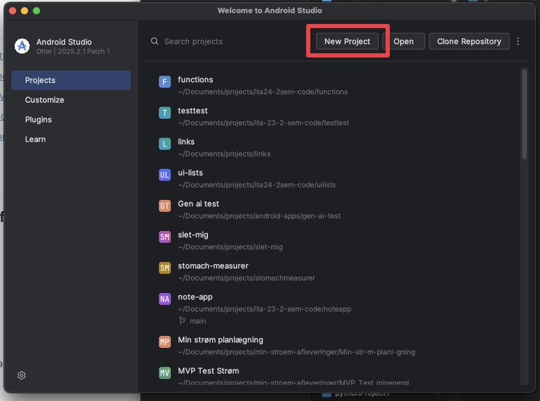
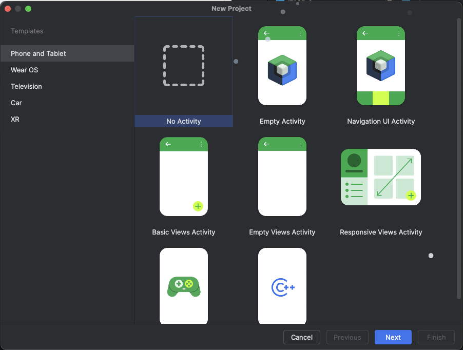
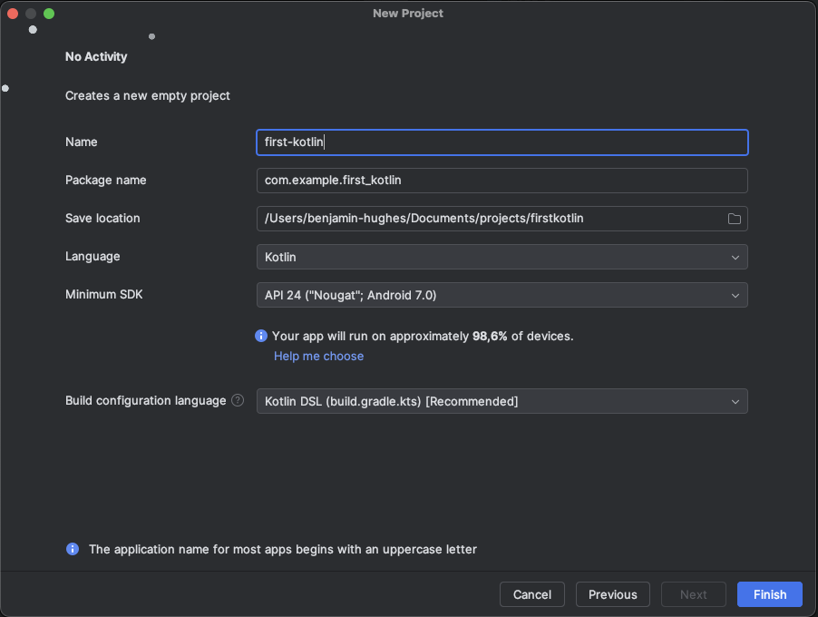
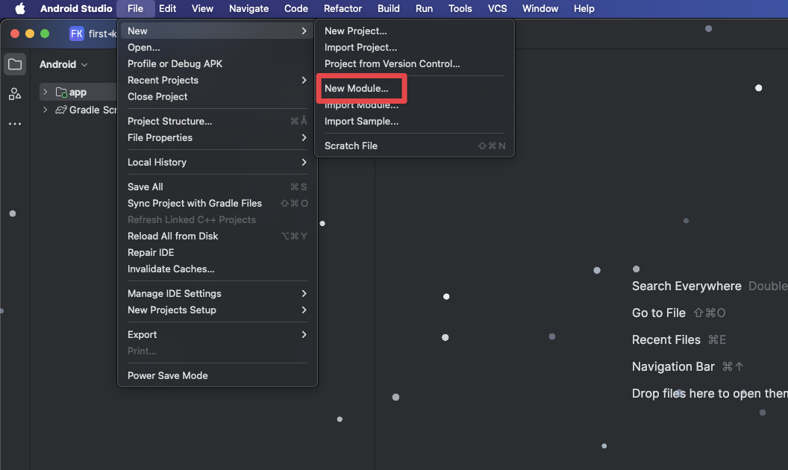
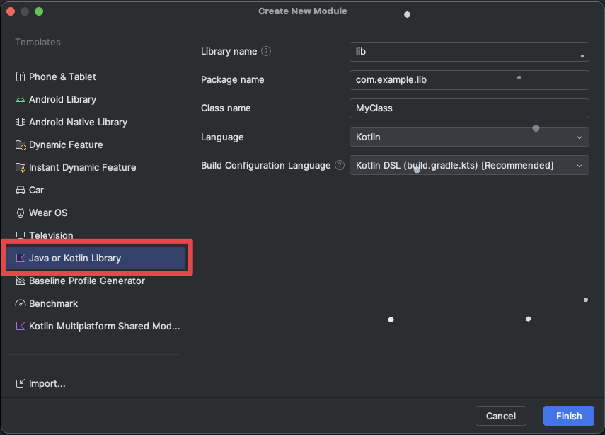
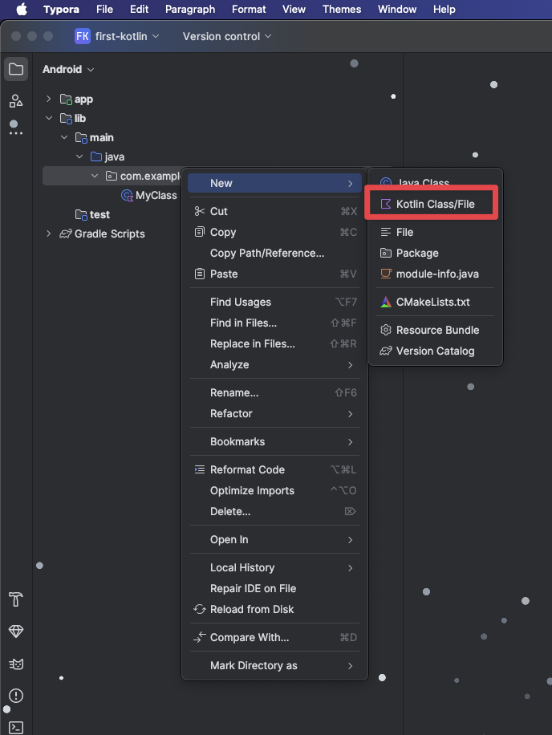
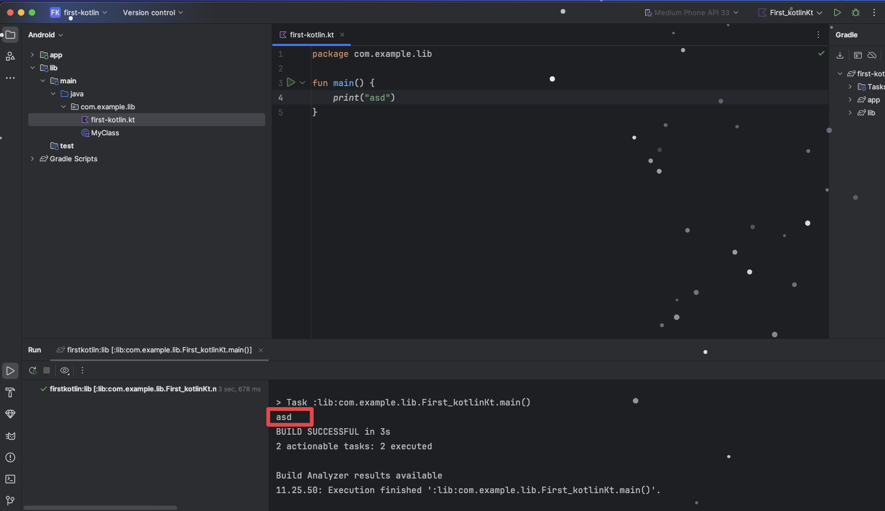

# Kotlin intro


## Learning goals

- Kotlin
  - Compile vs runtime
  - Interpretation vs compilation Tjek NIFR slides
  - JIT
  - Syntax
- Debugging
- Typer
  - Strenge
    - String literal
  - Boolean
  - Integer, float, double
  - Array fixed number of values
  - List
- Conditional (if/else)
  - Equality
  - When
- Loops
  - Ranges


## Overview

- Intro til applikationsudvikling faget
- Hvordan lærer jeg nyt stof
- Jeg koder lidt Kotlin
- Peer instruction
- Opgaver
- Pause kl 10
- Jeg løser en opgave af opgaverne


## Peer instruction


### Question 1

What will the following code output?

```kotlin
val str = "Kotlin"
val length = str.length
println("The length of the string is: $length")
```

1. The length of the string is: 6
2. The length of the string is: Kotlin
3. The length of the string is: 7
4. Syntax error
5. None of the above


### Question 2

What will this loop print?

```kotlin
for (i in 1..5) {
    if (i == 3) break
    println(i)
}

```

1. 1 2 3 4 5
2. 1 2 3
3. 1 2
4. 3
5. None of the above


## Benjamin koder

Create som code that defines an array of integers. The code should iterate through the array and apply the following transformations:

- If an element is even, divide it by 2.
- If an element is odd, multiply it by 3 and add 1.

```kotlin
original_list = [1, 2, 3, 4, 5]
transformed_list = transformList(original_array)
print(transformed_list) // [4, 1, 10, 2, 16]
```

It should log the transformed array

Cover debugging

Should video title be `val` or `var` [https://www.youtube.com/watch?v=d0d9nsTLaKo](https://www.youtube.com/watch?v=d0d9nsTLaKo)


## Preparation

- [Installer Android Studio](https://developer.android.com/studio)
- [Kotlin in 100 Seconds](https://www.youtube.com/watch?v=xT8oP0wy-A0)
- [Learn Kotlin in 12 Minutes](https://www.youtube.com/watch?v=iYrgWO2oibY)
- [Learn Kotlin for Android: When (Lesson 8)](https://www.youtube.com/watch?v=dollprkCDnk)
- [https://kotlinlang.org/docs/basic-syntax.html](https://kotlinlang.org/docs/basic-syntax.html) Optional


## Topics

### Running your first Kotlin script in Android studio

Først lav et nyt projekt




Vælg `No Acticity`




Giv projektet et navn



Vent på at Android Studio har bygget færdig


Nu skal du lave et nyt module `File -> New -> New Module`



Vælg `Java or Kotlin Library`




Nu kan du under mappen `lib -> main -> java -> com.example.lib` lave et nyt kotlin script ved at højreklikke på mappen og vælge: `New -> Kotlin Class/File`





Vælg File


Nu kan du tilføje koden:

```kotlin
package com.example.lib

fun main() {
    print("asd")
}
```


Trykke på den grønne play knap og så kan du se outputtet i konsollen




Ja puha sikke en omgang


### Main function

A kotlin file needs a main function

```kotlin
fun main() {
		println("Hello World");
}
```


### Variables

`var` is a variable that can be changed (mutable)

`val` is a variable that cannot be changed (nonmutable)


```kotlin
var price = 43;
price = 33;

val age = 36;
age = 55; // Error here!
```


### Types

For CS101 please declare your types for all variables and functions. If you do not declare your type the type will be interpreted (guessed) by the interpreter


```kotlin
var price: Int = 43;
price = 33;

val height: Double = 1.78;

val isExpensive: Boolean = true;
```


For some type we can just write the value directly. Like fx a string `val name: String = "Benjamin"`. For other more complex types we need to call a function to get the type we need. 


### `List`

A `List` is like an array in javascript. 

An array in Kotlin cannot be changed! Therefore usually we use `List` in Kotlin. Only if we have a usecase where a list should not be changed should we use an array

```kotlin
val array: Array<String> = arrayOf("asd", "hej");
```


To create a list, remember to think about if it should be mutable or non mutable (can be changed or cant be changed)

```kotlin
val prices: MutableList<Int> = mutableListOf(2,3,4,5);
```

The list works a lot like in js

```kotlin
val prices: MutableList<Int> = mutableListOf(2,3,4,5);
println(prices[1])

prices.add(67);
println(prices)
```


### Conditional statement

```kotlin
val age = 18
if (age >= 25) {
    println("You are an older adult")
} else if(age >= 18) {
    println("You are an adult")
} else {
    println("You are a minor.")
}
```


Using `if` as an Expression. Also called a ternary expression

```kotlin
val max = if (a > b) a else b
```


`when` Expression

```kotlin
val grade = 'A'
when (grade) {
    'A' -> println("Excellent")
    'B' -> println("Good")
    'C' -> println("Fair")
    else -> println("Poor")
}
```


### Loops

For Loop

```kotlin
for (i in 1..5) {
    println("Iteration $i")
}
```


While loop

```kotlin
var i = 0
while (i < 5) {
    println("Count: $i")
    i++
}
```


Ranges

```kotlin
val numbers = 1..10 // Includes 10
val letters = 'a' until 'z' // Excludes 'z'
```


## Opgaver


### Benjamins læringstilgang

I kan prøve min tilgang til læring hvis i tør. Men husk at være refleksiv omkring jeres læring! Ellers er der mere klassiske opgaver nedenfor


### Opgave 1 - Level 1

Do these steps one step at a time! Think about what type of data should be stored in the different variables

1. Create a variable called `age` (no reassignment!)
2. Create another variable called `height`
3. Assign `age` to be your age
4. Assign `height` to be your height in meter
5. Create the variable `shoeSize` and assign it to be your shoesize
6. Create a variable called `name` and assign this to your name


### Opgave 2 - Level 1

- Convert a string to uppercase
- Get the character on index 3
- Print the index of a character in the string
- Concatenate two different string
- Check these strings are equal to each other. Uppercases should be ignored!
  - `hello`, `ollhe` should print `false`
  - `bike`, `banana` should print `false`
  - `name`, `NaMe` should print `true`
  - `yes`, `yes` should print `true`


### Opgave 3 - level 1

Create a program that calculates and prints the sum of all even numbers between 1 and 50 using a `for` loop.


### Opgave 4 - level 2

Create a `List`. Add some prices to the `List`. Now find the second largest integer in that array


### Opgave 5 - level 1

Assign three variables `sideA`, `sideB`, and `sideC` representing the lengths of a triangle's sides. Use conditionals to determine and print the type of triangle:

- If all sides are equal, print `"Equilateral triangle"`.
- If exactly two sides are equal, print `"Isosceles triangle"`.
- If all sides are different, print `"Scalene triangle"`.
- If the sides cannot form a valid triangle (the sum of any two sides must be greater than the third), print `"Not a valid triangle"`.


### Opgave 6 - level 1

Create a program that takes an integer (1-7) representing a day of the week (1 for Monday, 7 for Sunday) and prints whether it's a weekday or weekend using a `when` expression.


### Exercise 7 - level 2

Write a program that loops through the numbers from 1 to 100. For each number, use conditionals to check the following:

- If the number is a perfect square **and** even, print the number and its square root.
- If not, continue to the next number without printing.

*A perfect square is an integer that is the square of an integer (e.g., 16 is a perfect square because it is 4 squared).*


### Opgave 8 - level 2

Simulate the growth of a population starting with 1,000 individuals. Each year, the population increases by 5%. Use a loop to calculate and print the population at the end of each year for up to 10 years. If at any point the population exceeds 1,500, print `"Population has exceeded 1,500"` and stop the simulation.


### Opgave 9 - level 2

Write some code that prompts the user to provide a number, computes the half of the number and prints the result with a friendly message

*Research how inputs work in Kotlin*


## 🔐 The code breaker - Level 3

[https://behu.gitbook.io/java-first-semester/projects/the-code-breaker#the-code-breaker](https://behu.gitbook.io/java-first-semester/projects/the-code-breaker#the-code-breaker)
